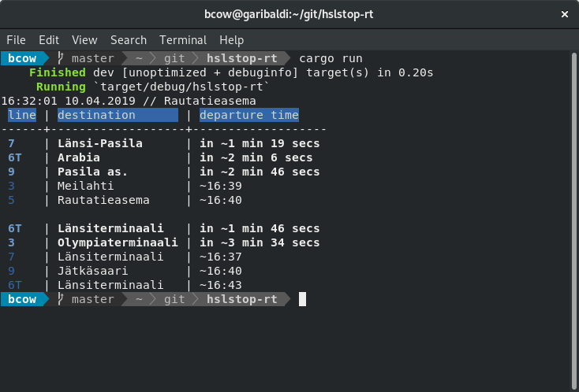

# hslstop-rt



GraphQL test against Digitraffic API as a functional example on Rust language. This application prints out a nice table in ASCII of departing lines (or trips in GraphQL query) for specified stop. Output also tries to emulate the HSL info screen in its color scheme.

Default values for configurable variables can be set either via .env file or by setting environment variables. Latter takes precedence if both are specified. Configurable values are:

* STOP_NAME, name of the stop you wish to observe. Pretty much anything goes here: internal id, station id visible usually outside the station itself or its "street name". There are too much variations to list here.
* API_URL, http address for the Digitraffic GraphQL endpoint
* DEPARTURE_ALERT, value in minutes inside of which prior to departure the formatting changes in output to make it visible (aka highlighted)

To run execute ```cargo run``` in the root dir.